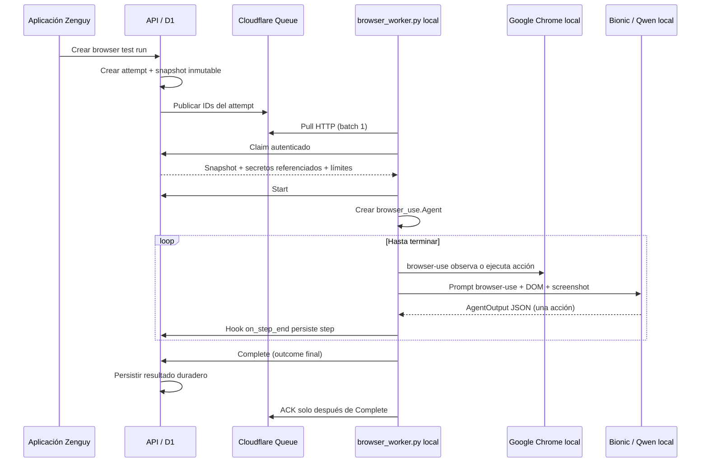

# Browser worker local con Bionic

Este documento describe la arquitectura, configuración y procedimiento de réplica del sistema de browser tests de Zenguy. El estado aquí documentado corresponde al 20 de agosto de 2026.

El objetivo es que la aplicación **no ejecute el navegador ni el modelo**. La aplicación crea el run, lo publica en Cloudflare Queues y un proceso Python independiente, ejecutado en un ordenador local, consume el trabajo, abre un navegador local, consulta un modelo servido por Bionic y devuelve todos los resultados a la aplicación.

Uso previsto:

```bash
./browser_worker.py             # producción
./browser_worker.py --staging   # staging
```

El launcher instala y reutiliza automáticamente su entorno Python local. No hay que activar manualmente un virtualenv.

> [!IMPORTANT]
> Staging está configurado y verificado de extremo a extremo. Producción está preparada en el código, pero su activación sigue bloqueada intencionadamente por los controles de release descritos en [Estado por entorno](#estado-por-entorno). En el estado actual, `./browser_worker.py --once` falla de forma explícita porque la cola de producción todavía no tiene un consumidor HTTP pull.

## Arquitectura



Propiedades importantes:

- Cloudflare solo mantiene la cola y la API; el navegador y la inferencia corren fuera de la aplicación.
- El mensaje de cola contiene identificadores, no instrucciones completas ni secretos.
- El worker reclama un attempt mediante una API autenticada antes de ejecutarlo.
- D1 conserva la propiedad del lease y la generación de ejecución, de modo que una entrega duplicada o antigua no puede ejecutar ni completar el mismo attempt de forma válida.
- El ACK de Cloudflare se envía únicamente después de que la API haya persistido el resultado final.
- Si el proceso local muere, vence el visibility timeout y Cloudflare vuelve a entregar el mensaje.
- Un consumidor Worker/push y un consumidor HTTP/pull no pueden convivir en la misma cola. Para este diseño solo debe existir el consumidor HTTP/pull.

## Ficheros relevantes

| Fichero | Función |
| --- | --- |
| `browser_worker.py` | Launcher raíz. Selecciona producción o staging, prepara el virtualenv y ejecuta el worker real. |
| `runner/browser_worker.py` | Consumidor de Queue, cliente de la API e integración real con `browser-use` y Bionic. |
| `runner/test_browser_worker.py` | Tests unitarios del worker Python. |
| `runner/smoke_browser_use.py` | Smoke local no destructivo que ejecuta el mismo `JobExecutor` contra `example.com`, sin tocar Queue ni la API remota. |
| `runner/requirements.txt` | Runtime fijado: `browser-use[core]==0.13.8`. |
| `runner/.browser_worker.local.json` | Tokens locales de staging y producción. Es privado, está ignorado por Git y debe tener modo `0600`. |
| `runner/.venv/` | Virtualenv autogenerado e ignorado por Git. |
| `apps/api/src/http/routes/runner.ts` | Callbacks privados que usa el worker externo. |
| `apps/api/src/application/durability/publish_outbox.ts` | Publicación duradera de attempts en Cloudflare Queues. |
| `apps/api/migrations/0016_external_runner_claims.sql` | Lease idempotente para entregas externas. |
| `apps/api/wrangler.jsonc` | Bindings, colas y variables de producción y del entorno `staging`. |
| `apps/api/wrangler.production-bootstrap.jsonc` | Despliegue aislado de bootstrap de producción, sin activar el servicio público. |

Los nombres internos pueden cambiar con futuras refactorizaciones, pero la frontera del sistema debe mantenerse: la API encola y persiste; el proceso Python reclama, ejecuta y reporta.

## Configuración exacta de Bionic

La instalación utilizada para la validación fue:

- Aplicación: Bionic
- Bundle: `ai.elementlabs.bionic`
- Versión: `1.0.7` (`build 2`, canal estable)
- CLI de LM Studio/Bionic: `/Users/maguayo/.lmstudio/bin/lms`
- Base OpenAI-compatible: `http://127.0.0.1:1234/v1`
- Endpoint de inferencia: `/v1/chat/completions`
- Modelo API: `qwen/qwen3.8-27b`
- Variante local: `qwen/qwen3.8-27b@q4_k_m`
- Reasoning effort: `xhigh`
- Vision: activada
- Autenticación local de Bionic: desactivada; el worker envía el valor no secreto `local-runner` como API key compatible.

En **Bionic → Settings → Local Models → Local Model API** se configuró:

| Opción | Valor |
| --- | --- |
| Local API server | ON |
| Base URL | `http://localhost:1234/v1` |
| Just-in-time model loading | ON |
| CORS | OFF |
| Verbose logs | OFF |
| Redact request content in logs | ON |

Bionic recuerda el último estado del servidor. Además, el worker comprueba `/v1/models` y, si no responde, intenta arrancarlo mediante:

```bash
/Users/maguayo/.lmstudio/bin/lms server start
```

Para comprobar el identificador real del modelo en otra máquina:

```bash
curl -sS http://127.0.0.1:1234/v1/models
```

No se debe usar el nombre visual de la interfaz si el campo `id` de esta respuesta es diferente. El valor que debe ir en el worker es el `id` de la API.

La metadata observada para este modelo fue:

- arquitectura `qwen35`;
- cuantización GGUF `Q4_K_M`;
- aproximadamente 17,7 GB y 27B parámetros;
- contexto máximo de 262.144 tokens;
- vision y tool use disponibles;
- niveles de razonamiento `off`, `low`, `medium`, `xhigh` y `on`, con `xhigh` como valor por defecto.

El adaptador `browser_use.ChatOpenAI` llama a `chat/completions` sin temperatura y con `reasoning_effort: "xhigh"`. `browser-use` construye el prompt, el estado del DOM, la captura y su esquema dinámico de acciones; Qwen devuelve un `AgentOutput` y la librería ejecuta una acción por paso.

Bionic acepta `response_format` de tipo `json_schema` o `text`, pero su parser de gramáticas no puede compilar la unión dinámica y profundamente anidada de acciones que genera `browser-use 0.13.8`. Por eso el worker incluye un adaptador mínimo sobre `browser_use.ChatOpenAI`: envía ese esquema en el system prompt con `response_format: {"type":"text"}`, extrae candidatos JSON de la respuesta y solo acepta el que valide contra el modelo Pydantic exacto que entrega `browser-use`. El agente, el navegador, las tools, el historial, los hooks y el `done` siguen perteneciendo a `browser-use`; no existe un segundo agente Playwright implementado por Zenguy.

Los logs locales de Bionic están en:

```text
/Users/maguayo/.lmstudio/apps/bionic/server-logs
```

Conviene mantener el contenido redactado y los logs verbosos desactivados porque las capturas y el estado de la página pueden contener información sensible.

## Cómo ejecuta los tests `browser-use`

La clase `JobExecutor` usa directamente la API pública de `browser-use 0.13.8`:

1. Crea un `browser_use.ChatOpenAI` adaptado al endpoint local de Bionic.
2. Crea un `browser_use.BrowserProfile` con Google Chrome visible, viewport del snapshot y un perfil temporal aislado.
3. Crea `browser_use.Tools`, elimina acciones de ficheros, JavaScript arbitrario, búsquedas, uploads y PDF, y sobrescribe `navigate` para validar DNS/IP y aplicar la política SSRF de Zenguy.
4. Traduce `{{NOMBRE}}` a `<secret>NOMBRE</secret>` y entrega los valores a `browser-use` mediante `sensitive_data` con ámbito por dominio.
5. Instancia `browser_use.Agent` con una sola acción por step, vision cuando no hay secretos, resultado final Pydantic `BrowserTestResult` y límites recibidos de la aplicación.
6. Ejecuta `Agent.run(...)`. El hook `on_step_end` convierte cada elemento del historial en un callback `/steps`, incluida una captura JPEG cuando está permitido.
7. Lee `history.structured_output`, URLs y tokens; publica `/complete`; únicamente después el bucle de Queue hace ACK.
8. Cierra Chrome y elimina exclusivamente los directorios temporales creados por `browser-use`.

No se persiste el razonamiento interno de Qwen. Los steps guardan únicamente la acción observable, su resultado, URL saneada y captura permitida. La telemetría anónima, el cloud sync y el transcript INFO de `browser-use` están desactivados antes de importar la librería; el proceso imprime únicamente eventos JSON compactos y redactados del worker.

## Configuración local del launcher

La copia actual está orientada a este Mac y contiene rutas deliberadamente hardcodeadas:

| Ajuste | Valor actual |
| --- | --- |
| Python | `/opt/homebrew/bin/python3.11` |
| CLI Bionic/LM Studio | `/Users/maguayo/.lmstudio/bin/lms` |
| Navegador `browser-use` | Google Chrome en `/Applications/Google Chrome.app/Contents/MacOS/Google Chrome` |
| Modo navegador | visible, `headless=False` |
| Perfil de Chrome | perfil temporal de `browser-use`; no reutiliza la sesión personal de Chrome |
| Perfil Wrangler | `zenguy-personal` |
| Poll cuando no hay mensajes | 5 segundos |
| API del modelo | `http://127.0.0.1:1234/v1` |
| Modelo | `qwen/qwen3.8-27b` |

El launcher raíz realiza esta secuencia:

1. Busca el Python configurado.
2. Comprueba si `runner/.venv` contiene exactamente `browser-use 0.13.8`.
3. Si hace falta, crea o repara el virtualenv e instala `runner/requirements.txt`.
4. Reemplaza el proceso por `runner/browser_worker.py` usando el Python del virtualenv.

El navegador usado es Google Chrome local. `browser-use` lo controla mediante su `BrowserProfile` aislado para evitar que un test acceda accidentalmente a cookies, extensiones o sesiones personales.

En otro sistema operativo hay que adaptar, como mínimo:

- `SYSTEM_PYTHON` en el launcher;
- `BIONIC_LMS_BIN` en el worker;
- el canal del navegador si no existe Google Chrome;
- `headless` si el host no tiene sesión gráfica;
- el perfil de Wrangler y los valores de los entornos.

## Valores específicos de esta instalación

Estos identificadores no son secretos, pero pertenecen a la cuenta actual y deben sustituirse al replicar el sistema.

| Entorno | API | Queue | Queue ID | DLQ | Worker API |
| --- | --- | --- | --- | --- | --- |
| staging | `https://staging-app.zenguy.com` | `zenguy-staging-runs` | `da714b57571f4659ad192f4b97502ccb` | `zenguy-staging-runs-dlq` | `zenguy-api-staging` |
| producción | `https://app.zenguy.com` | `zenguy-runs` | `451d4869602d4f65bfd8f4c2840d2af4` | `zenguy-runs-dlq` | `zenguy-api-production` |

Cuenta Cloudflare actual:

```text
ec11e46fe3c39a5eac9951db9c91244a
```

El consumidor HTTP de staging creado durante la configuración tuvo el ID:

```text
5964ce3afddb4d5898ad2181a429807b
```

El mapa de entornos y estos IDs están hardcodeados en `runner/browser_worker.py`, tal como se solicitó para que el comando de uso sea mínimo.

## Autenticación y secretos

Hay dos credenciales distintas y nunca deben confundirse:

1. **Credencial de Cloudflare Queues.** Permite al proceso local hacer pull y ACK en la cola.
2. **`RUNNER_API_TOKEN` de Zenguy.** Permite reclamar y actualizar attempts a través de `/api/runner`.

### Credencial de Cloudflare

La implementación actual reutiliza el token OAuth del perfil local de Wrangler:

```bash
pnpm --filter @zenguy/api exec wrangler auth token --json --profile zenguy-personal
```

El worker captura ese token en memoria y no lo imprime ni lo copia a ningún fichero suyo. Para replicar la instalación sin tocar el código:

1. Instalar Wrangler a través de las dependencias del repositorio.
2. Iniciar sesión en Cloudflare.
3. Dejar activo un perfil llamado `zenguy-personal`, o cambiar `WRANGLER_PROFILE` en el worker.
4. Verificar que el token puede leer y escribir en Queues.

Como alternativa más limitada, se puede usar un API token dedicado con permisos de lectura y escritura de Cloudflare Queues. Para ello habría que modificar `cloudflare_queues_token()` para leerlo desde un keychain o variable de entorno segura. No debe incluirse un token Cloudflare en Git.

### Token de la API del runner

Cada entorno usa un token independiente de al menos 32 caracteres. Una forma de generarlo es:

```bash
openssl rand -hex 32
```

El mismo valor se instala como secret del Worker de ese entorno y se guarda solo en el ordenador que ejecutará los tests.

Ejemplo para staging:

```bash
pnpm --filter @zenguy/api exec wrangler secret put RUNNER_API_TOKEN --env staging --profile zenguy-personal
```

Ejemplo para producción, únicamente cuando se autorice el release:

```bash
pnpm --filter @zenguy/api exec wrangler secret put RUNNER_API_TOKEN --profile zenguy-personal
```

Fichero local esperado:

```json
{
  "production_runner_token": "SUSTITUIR_POR_UN_TOKEN_DISTINTO",
  "staging_runner_token": "SUSTITUIR_POR_OTRO_TOKEN_DISTINTO"
}
```

Ubicación:

```text
runner/.browser_worker.local.json
```

Permisos:

```bash
chmod 600 runner/.browser_worker.local.json
```

Este fichero y `runner/.venv/` están incluidos en `.gitignore`. No se deben documentar, copiar o registrar los valores reales de los tokens.

## API privada del runner

La API expone estos endpoints bajo el origen de cada entorno:

```text
POST /api/runner/attempts/claim
POST /api/runner/attempts/:attemptId/start
POST /api/runner/attempts/:attemptId/steps
POST /api/runner/attempts/:attemptId/complete
```

Todas las peticiones usan:

```http
Authorization: Bearer <RUNNER_API_TOKEN>
Content-Type: application/json
```

Las respuestas privadas incluyen `Cache-Control: no-store`.

El mensaje publicado por la aplicación en Queue tiene esta forma conceptual:

```json
{
  "kind": "attempt",
  "runId": "run_...",
  "attemptId": "att_...",
  "attemptIndex": 0,
  "executionGeneration": 1
}
```

Al reclamarlo, el worker envía un delivery ID idempotente junto con el mensaje. La API valida:

- que el run y el attempt existen;
- que los IDs, índice y generación coinciden;
- que el attempt sigue siendo reclamable;
- que esa entrega no pertenece ya a otro attempt;
- que el estado no ha sido completado o cancelado.

Si el claim es válido, la respuesta contiene:

- una referencia firmemente asociada al attempt y al lease;
- un snapshot inmutable de las instrucciones y configuración del test;
- únicamente los secretos referenciados por el test;
- límites de ejecución.

El worker repite esa referencia al iniciar, añadir cada step y completar. Esto evita que una entrega vieja termine una ejecución nueva.

La migración `0016_external_runner_claims.sql` añade `runner_delivery_id` a `test_attempts` y un índice único parcial. Debe aplicarse antes de desplegar la API que acepta claims externos.

## Configuración de Cloudflare Queues

Configuración elegida para cada cola:

| Parámetro | Valor |
| --- | --- |
| Tipo de consumidor | HTTP pull |
| Batch size | `1` |
| Visibility timeout | `900` segundos |
| Reintentos | `3` |
| Retry delay | `30` segundos |
| Dead-letter queue | la DLQ correspondiente al entorno |

Un solo proceso ejecuta un test cada vez. Se pueden arrancar varios procesos o máquinas para aumentar la concurrencia; Queue distribuye los mensajes y el lease de D1 protege contra duplicados.

### Procedimiento reproducible para staging

Desde la raíz del repositorio:

1. Aplicar la migración remota:

   ```bash
   pnpm --filter @zenguy/api exec wrangler d1 migrations apply zenguy-staging-db --remote --env staging --profile zenguy-personal
   ```

2. Instalar `RUNNER_API_TOKEN` en Cloudflare y guardar el mismo valor en el fichero local privado.

3. Desplegar la API de staging:

   ```bash
   pnpm --filter @zenguy/api exec wrangler deploy --env staging --profile zenguy-personal
   ```

4. Eliminar el consumidor Worker/push anterior, si existe:

   ```bash
   pnpm --filter @zenguy/api exec wrangler queues consumer worker remove zenguy-staging-runs zenguy-api-staging --profile zenguy-personal
   ```

5. Crear el consumidor HTTP pull:

   ```bash
   pnpm --filter @zenguy/api exec wrangler queues consumer http add zenguy-staging-runs --batch-size 1 --message-retries 3 --dead-letter-queue zenguy-staging-runs-dlq --visibility-timeout-secs 900 --retry-delay-secs 30 --profile zenguy-personal
   ```

6. Consultar la cola y copiar su ID al mapa de entornos del worker:

   ```bash
   pnpm --filter @zenguy/api exec wrangler queues list --profile zenguy-personal
   ```

7. Esperar unos segundos a que se propague el consumidor y probar un pull vacío:

   ```bash
   ./browser_worker.py --staging --once
   ```

8. Crear un test desechable en staging y ejecutar de nuevo el comando anterior. Confirmar en la aplicación que aparecen los steps y el resultado final.

Inmediatamente después de crear el consumidor se observó una respuesta `405`; era propagación de Cloudflare. Repetir el smoke test unos segundos después confirmó el funcionamiento. Si persiste, comprobar que existe un consumidor HTTP y que no queda un consumidor Worker.

### Procedimiento para un entorno nuevo

1. Crear la Queue y su DLQ.
2. Asegurar que la API tiene un binding productor hacia esa Queue.
3. Añadir la URL, nombres, Queue ID y token local al mapa de entornos del worker.
4. Aplicar todas las migraciones D1, incluida `0016`.
5. Generar un `RUNNER_API_TOKEN` exclusivo para el entorno.
6. Desplegar la API.
7. Quitar cualquier consumidor Worker/push de la Queue de runs.
8. Añadir el consumidor HTTP/pull con batch 1, timeout 900, tres reintentos, delay 30 y DLQ.
9. Ejecutar primero un pull vacío y después un run desechable completo.

## Ejecución diaria

Producción:

```bash
./browser_worker.py
```

Staging:

```bash
./browser_worker.py --staging
```

El proceso queda sondeando la cola hasta que se interrumpe con `Ctrl+C`.

Para diagnóstico existe una opción oculta que procesa como máximo un pull y termina:

```bash
./browser_worker.py --staging --once
./browser_worker.py --once
```

`--once` no aparece en la ayuda pública porque el contrato operativo deseado se limita a los dos comandos principales.

Secuencia de arranque esperada:

1. Validación de configuración y tokens.
2. Obtención temporal del token Wrangler.
3. Comprobación o arranque de Bionic.
4. Comprobación de que `qwen/qwen3.8-27b` está disponible.
5. Poll de Cloudflare Queue.
6. Cuando se reclama un run, creación de `browser_use.Agent` y lanzamiento de Google Chrome visible.

## Seguridad

La ejecución de un modelo sobre páginas web requiere tratar la página como entrada no confiable. Se aplicaron estas medidas:

- El contenido de una página nunca puede redefinir las instrucciones del sistema; cualquier texto web puede ser prompt injection.
- El worker bloquea destinos localhost, privados, link-local, reservados, metadata y hosts que resuelvan a IP no global, como defensa SSRF.
- Los orígenes remotos de la API de Zenguy deben usar HTTPS.
- La API de Bionic está fijada a loopback.
- Los secretos se conservan como tags de `sensitive_data`; `browser-use` los sustituye únicamente en acciones autorizadas sobre los dominios permitidos.
- Credenciales incluidas en URL, fragments y query params sensibles se eliminan o redactan antes de registrar el estado.
- Si un attempt utiliza secretos, sus screenshots se desactivan durante toda la ejecución para evitar persistir valores visibles.
- El razonamiento interno del modelo no se guarda como descripción de los steps.
- La telemetría anónima y el cloud sync de `browser-use` están desactivados.
- Las acciones de lectura/escritura de ficheros, evaluación JavaScript, búsqueda web, upload y PDF no están disponibles para el agente.
- Las acciones destructivas en un navegador real solo deben formar parte de instrucciones de test explícitas. No se deben usar credenciales ni datos productivos en pruebas desechables.
- El token de Cloudflare y el `RUNNER_API_TOKEN` tienen ámbitos y almacenamiento separados.
- Cada entorno tiene un token de runner diferente.
- Ningún token real forma parte de este documento ni del repositorio.

## Semántica de errores y reintentos

No todos los errores se manejan igual:

- **Éxito o fallo funcional del test:** se envía `complete` a la API y después se hace ACK del mensaje.
- **Fallo controlado del navegador o modelo:** se persiste como outcome del attempt y después se hace ACK.
- **Fallo transitorio de red/API:** no se hace ACK; Queue podrá volver a entregar el mensaje.
- **Caída del worker:** no hay ACK; el mensaje reaparece al vencer los 900 segundos.
- **Mensaje ilegible o incompatible:** se considera poison message y se hace ACK para que no forme un bucle infinito; queda registrado sin secretos.
- **Entrega duplicada:** el claim idempotente devuelve el attempt existente o rechaza una entrega incompatible.
- **Ejecución abandonada:** la recuperación de attempts estancados puede convertirla en `WORKER_LOST`.

El orden `complete → respuesta duradera de la API → ACK` es una invariante del diseño. No debe invertirse.

## Compatibilidad del formato Queue

Durante el primer run real apareció una diferencia importante entre la documentación y el cuerpo observado. Con `CF-Content-Type: json`, Cloudflare entregó el body como JSON sin codificar, mientras que la primera versión del decoder asumía siempre base64.

El decoder final acepta, en este orden:

1. un objeto JSON ya decodificado;
2. un string de JSON crudo cuando el content type es `json`;
3. JSON o bytes codificados en base64 como fallback compatible con el formato documentado.

Se añadió el test de regresión `test_decodes_raw_cloudflare_json_content`. Esta compatibilidad no debe retirarse sin verificar otra vez el payload real de Cloudflare.

## Estado por entorno

### Staging: operativo

Se completaron estas acciones:

- aplicación remota de `0016_external_runner_claims.sql`;
- instalación de `RUNNER_API_TOKEN`;
- despliegue de la API actualizada;
- eliminación del consumidor Worker anterior;
- creación del consumidor HTTP pull;
- smoke de autenticación de callbacks;
- smoke de Chrome visible;
- inferencia local fría y caliente con Qwen;
- run completo Queue → worker local → Chrome/Bionic → callbacks → ACK;
- pull vacío final.

El run de validación fue:

```text
run:     run_01m0ftedz912vye0w75yrtqf0j
attempt: att_01m0ftedz9hj02vmwtzxa1rrwv
```

Ese run se ejecutó con la primera implementación del worker, anterior a la migración a `browser-use`: visitó `https://example.com/`, quedó en `PASSED`, registró `zenguy-local-runner/1.0.0` y 2.734 tokens, y Queue recibió el ACK después de persistir el resultado. Se conserva como evidencia del protocolo Queue/callbacks, no como evidencia de la librería actual.

Después de la migración se ejecutó `runner/smoke_browser_use.py` con el `JobExecutor` actual. `browser-use 0.13.8` abrió Chrome visible, visitó `https://example.com/`, observó el encabezado exacto `Example Domain` y el enlace `Learn more`, emitió la acción estructurada `done` y finalizó `PASSED` en dos steps. La ejecución final registró `qwen/qwen3.8-27b`, `zenguy-local-runner/2.0.0+browser-use-0.13.8`, 9.886 tokens, screenshot y URL visitada. Este smoke es local y deliberadamente no publica en Queue ni llama a la API remota.

### Producción: preparada, no activada

Se generó e instaló un `RUNNER_API_TOKEN` de producción y el launcher contiene su configuración, pero no se realizaron estas acciones:

- aplicar las migraciones pendientes de producción;
- desplegar la nueva API sobre la ruta activa;
- crear el consumidor HTTP pull de producción.

En el momento de la configuración había ocho migraciones pendientes, de `0009` a `0016`. Además, los gates de release indican que faltan la configuración Paddle Live, Twilio de producción, el webhook firmado y la activación final. El endpoint `/api/health` de producción devolvía el shell del frontend, no el Worker API.

La cola `zenguy-runs` no tiene consumidor. Por eso `./browser_worker.py --once` termina limpiamente con el mensaje de que HTTP pull no está habilitado para ese entorno. Es una salvaguarda intencional.

No se debe activar producción copiando mecánicamente los comandos de staging. Primero hay que completar la checklist de release del repositorio, aplicar todas las migraciones en orden, verificar secretos y bindings, desplegar la API y solo entonces sustituir el consumidor por HTTP pull.

## Validación realizada

Durante la implementación del protocolo externo se ejecutaron las suites de la aplicación; después de la migración a `browser-use` se volvió a ejecutar la suite Python y el smoke local real:

| Suite | Resultado |
| --- | --- |
| API unit | 638 tests, 93 ficheros |
| Frontend | 190 tests, 62 ficheros |
| API integration | 224 tests, 42 ficheros |
| Worker Python | 21 tests |
| Total registrado | 1.073 tests |
| Typecheck | correcto |
| Builds | correctas |
| `git diff --check` | correcto |
| Dry-run/deploy staging | correcto |

También se comprobaron:

- import y runtime real de `browser-use 0.13.8`;
- `browser_use.Agent`, `ChatOpenAI`, `BrowserProfile`, `Tools`, `on_step_end` y `structured_output` contra Bionic real;
- compatibilidad Bionic mediante modo `text` y validación Pydantic del `AgentOutput`;
- carga bajo demanda del modelo;
- lanzamiento y cierre de Chrome con `headless=False`;
- smoke local `PASSED`, dos steps, screenshot y 9.886 tokens;
- token correcto mediante un claim inválido sin mutación: HTTP 400 de validación y `Cache-Control: no-store`;
- ejecución real y persistencia del resultado;
- cola vacía después del ACK.

## Checklist de réplica

Usar esta lista al instalarlo en otro ordenador o cuenta:

- [ ] Instalar Bionic y el modelo.
- [ ] Activar Local Model API y aplicar los ajustes de redacción indicados.
- [ ] Confirmar el model ID real con `/v1/models`.
- [ ] Instalar Google Chrome.
- [ ] Instalar un Python compatible y actualizar `SYSTEM_PYTHON`.
- [ ] Actualizar la ruta de `lms`.
- [ ] Clonar el repositorio y ejecutar el launcher una vez para crear `.venv`.
- [ ] Confirmar que instala exactamente `browser-use[core]==0.13.8`.
- [ ] Ejecutar `runner/.venv/bin/python runner/smoke_browser_use.py` y obtener `smoke_complete` con `status: PASSED`.
- [ ] Autenticar Wrangler con un perfil de permisos mínimos.
- [ ] Crear colas y DLQ o copiar sus IDs reales.
- [ ] Aplicar `0016` y todas las migraciones anteriores.
- [ ] Generar tokens de runner distintos para cada entorno.
- [ ] Instalar cada token como secret remoto y en el JSON local `0600`.
- [ ] Sustituir account ID, queue IDs, URLs y nombres en el mapa del worker.
- [ ] Desplegar la API que incluye `/api/runner`.
- [ ] Eliminar el consumidor Worker/push de la cola de runs.
- [ ] Añadir el consumidor HTTP/pull.
- [ ] Ejecutar un pull vacío con `--once`.
- [ ] Ejecutar un test desechable contra un dominio público seguro.
- [ ] Confirmar steps, outcome final y cola vacía.
- [ ] No activar producción hasta completar sus gates de release.

## Diagnóstico rápido

### `Cloudflare Queue HTTP pull is not enabled`

La Queue no tiene consumidor HTTP, el consumidor aún se está propagando o el Queue ID corresponde a otro entorno. Consultar consumers, esperar unos segundos y repetir.

### HTTP 401/403 al hacer pull

El token obtenido del perfil Wrangler no pertenece a la cuenta indicada o no tiene permisos Queues Read/Write. Volver a autenticar el perfil correcto o usar un token dedicado.

### HTTP 401 en `/api/runner`

El token local no coincide con el secret `RUNNER_API_TOKEN` del entorno. No copiar el token de staging a producción ni viceversa.

### El modelo no aparece

Comprobar Bionic, `lms server status`, `/v1/models` y el model ID exacto. Just-in-time loading puede hacer que la primera inferencia tarde bastante más.

### Chrome no arranca

Instalar Google Chrome o adaptar `CHROME_EXECUTABLE` y `browser_channel`. En un host sin interfaz gráfica, cambiar a headless y verificar las dependencias que requiera `browser-use`.

### `Failed to initialize samplers: failed to parse grammar`

Bionic está recibiendo directamente el `json_schema` dinámico de `browser-use`. Mantener el adaptador `BionicChatOpenAI` del worker: usa `response_format: text`, añade el schema al prompt y valida localmente con el modelo Pydantic de la librería. No volver a activar el `json_schema` nativo sin probar primero el schema completo del agente.

### El primer step tarda más de dos minutos

Es esperable en una inferencia fría de Qwen 27B con `reasoning_effort: xhigh`. El worker permite hasta 240 segundos por llamada sin superar el deadline global del attempt. Just-in-time loading y la caché hacen que ejecuciones posteriores puedan ser más rápidas.

### El mensaje vuelve a aparecer

El worker no alcanzó un `complete` duradero o murió antes del ACK. Revisar el error de transporte y dejar que el claim idempotente decida si debe reanudar, rechazar o marcar la ejecución perdida.

### El mensaje llega como texto y no como base64

Es un formato soportado. No restaurar el decoder antiguo: Cloudflare entregó JSON crudo en la prueba real aunque el content type fuera `json`.

## Plan B: worker de respaldo

Este documento describe el camino principal (worker local + Bionic). Existe
además un modo de respaldo `./browser_worker.py --fallback` pensado para un
VPS: no usa Cloudflare Queues y reclama contra la API únicamente los attempts
que el worker local no ha cogido en 10 segundos, ejecutándolos con la API de
OpenAI (`gpt-5-mini` por defecto). El diseño completo, las decisiones y la
checklist de activación están en `BACKUP_RUNNER.md` en la raíz del
repositorio.

## Referencias oficiales

- [LM Studio: iniciar y gestionar el servidor local](https://lmstudio.ai/docs/developer/core/server)
- [LM Studio: endpoint OpenAI-compatible de modelos](https://lmstudio.ai/docs/developer/openai-compat/models)
- [LM Studio: structured output OpenAI-compatible](https://beta.lmstudio.ai/docs/developer/openai-compat/structured-output)
- [browser-use: repositorio y quick start](https://github.com/browser-use/browser-use)
- [browser-use: modelos soportados y endpoints OpenAI-compatible](https://docs.browser-use.com/open-source/supported-models)
- [browser-use: lifecycle hooks](https://docs.browser-use.com/open-source/customize/hooks)
- [browser-use: resultado estructurado](https://docs.browser-use.com/open-source/customize/agent/output-format)
- [browser-use: parámetros del Agent](https://docs.browser-use.com/open-source/customize/agent/all-parameters)
- [Cloudflare Queues: pull consumers](https://developers.cloudflare.com/queues/configuration/pull-consumers/)
- [Cloudflare Queues: publicar por HTTP](https://developers.cloudflare.com/queues/examples/publish-to-a-queue-via-http/)

## Principio de mantenimiento

Al evolucionar este sistema, mantener siempre estas cuatro fronteras:

1. La aplicación crea, encola y persiste.
2. Queue transporta identificadores y gestiona reentregas.
3. El worker local es el único que controla el navegador y el modelo.
4. La API confirma de forma duradera antes de que el worker haga ACK.

Si una modificación hace que Cloudflare vuelva a ejecutar el navegador/modelo, envía secretos completos en Queue o reconoce el mensaje antes de persistir `complete`, rompe el objetivo original de esta arquitectura.
